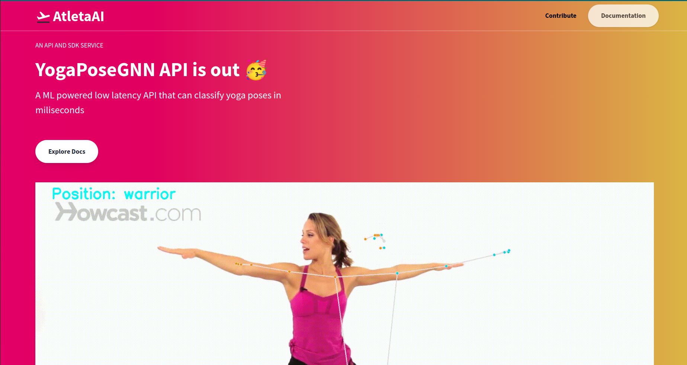

# **AtletaAI**

There are three parts of the project

1. Atelta API 
2. Atelta Trainer : For online / offline training and validation purposes of the model 
3. Atelta Web 

This is the first part of the. This will contain the APIs for predictions and other backend features. Atelta Comprises of 3-4 modes for easy tracking and self training

1. Atelta Yoga : Yoga positions 
2. Atelta Martial : Martial arts position 
3. Atelta Groove : Dance positions 

Roadmap of the API:

- Finishing the initial YogaPoseGNN API and integrate with the web 
- Starting of fresh by creating the auth and user DB 
- Creating a dashboard for tracking the self training consistency and improvement
- Starting to create the self-trainer interface

For this initial API, Build two images 

- A Docker image pulled from NVCR
- Another image for cpu based 